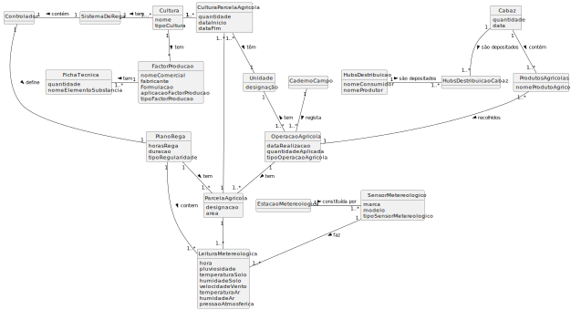

# USLP 01 -  Modelo de domínio (nível conceptual)

## 1 - Documentação

### 1.1 - Explicação de ligações no modelo dadas pelo cliente

Tendo por base os esclareciemntos dados pelo cliente (documentados como perguntas e respostas em [Readme.mb](docs/sprint1/LAPR3/lp01/01.requirements-engineering/Readme.md))
elaboramos o seguinte modelo de dominio:

Sendo assim, começamos por adicionar o conceito de cultura. Este possui associado um sistema de rega, ligado a um controlador, que defenirá um plano de rega.

Além disto, cultura támbem está associado ao conceito de parcela. 
Por conseguinte, é necessário acrescentar uma tabela secundária entre cultura e parcela, visto que, podemos associar multiplas culturas a diferentes parecelas (dúvida esclarecida pelo cliente).
Ademais, esta tabela também está associada ao conceito de unidade.

Seguidamente, também é possível ligar a cultura ao fator de produção. Este tem uma ficha técnica que guarda os dados das quantidades e elementos quimicos referentes ao fator.

Explorando o conceito de parcela, esta possui uma área e desginação, e está associada, além da cultura, ao plano de rega (já que este contêm dados referentes a parcelas), às leituras meteriológicas e operações agriculas.
Cada leitura utiliza um conjunto de sensores, que fazem parte de uma estação meteriológica. Esta é registada no plano de rega, sendo realizada para uma parcela especifica. 

Assim, ainda temos o conceito de operação agricula. Esta tem associada uma parcela, um caderno de campo (onde são registados todos os dados das operações agriculas relevantes) e um conjunto de produtos.

Por fim, foi criada a associação entre produtos e cabazes, uma vez que o cliente pode encomentadar um cabaz (conjunto de produtos para uma data específica) que será armazenado e, de seguida, 
lhe será entregue através Hubs de distribuição.

